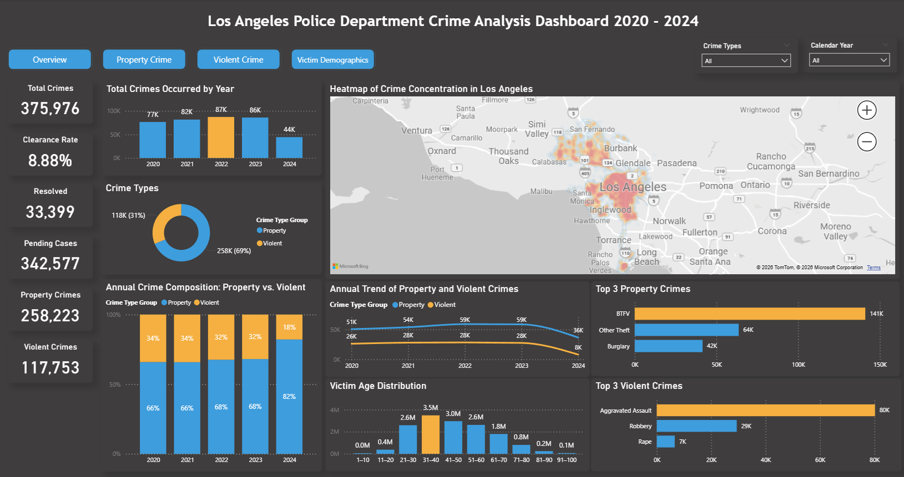
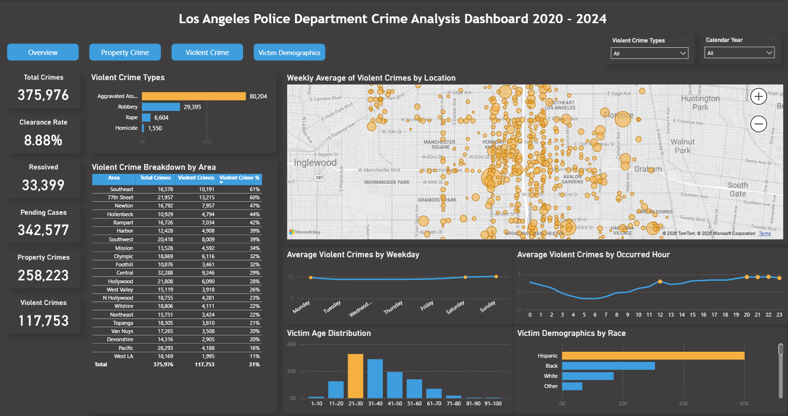
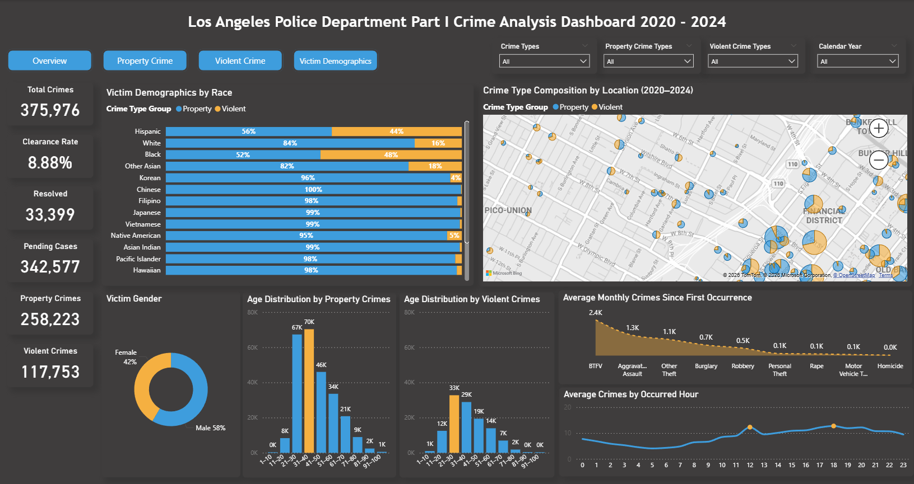

# Power BI Portfolio Projects

## About These Projects

This portfolio includes one real-world data analysis project and three academic case studies completed as part of my Business Analytics coursework. While the academic projects use simulated datasets, the methodologies, tools, and analytical approaches reflect how I tackle actual business challenges using Power BI, DAX, and data-driven insights.

---

## Project 1: Mapping Major Crimes in Los Angeles (2020-2024)

**Project Overview**  
Analyzed Part 1 crime data in Los Angeles from 2020 to 2024, visualizing spatial and temporal patterns of property and violent crimes through Power BI. Identified that 70% of crimes were property-related and concentrated in commercial areas, while violent crimes clustered in low-income communities. Developed data-driven recommendations for targeted patrol strategies and community safety improvements.

**Data Source:** Los Angeles Police Department public crime records (2020-2024)

**Technologies Used**
- Power BI Desktop (Interactive maps & dashboards)
- Power Query for ETL and data cleaning (handled missing coordinates, standardized crime codes)
- DAX (SWITCH for crime classification, CALCULATE for time-based metrics)
- Spatial-Temporal Analysis (Crime hotspot mapping, time series analysis)

**Key Achievements**
- Built an interactive crime hotspot map integrating time, location, and crime type dimensions, using DAX SWITCH function to classify complex LAPD crime codes into 7 major categories with 95% accuracy
- Identified distinct spatial-temporal patterns: property crimes concentrated at noon and 6 PM in commercial areas, while violent crimes clustered in low-income communities, with individuals aged 21-30 at highest risk
- Proposed actionable policy recommendations: distribute theft prevention cards in high-risk zones, implement automated alert systems, and conduct Night Safety Workshops, with projected crime reduction of 15-20%

---

**Screenshots**

*Overview dashboard with total crime statistics, clearance rates, and demographic breakdowns*

*Geospatial visualization of property crime distribution across Los Angeles*

*Geospatial visualization of violent crime distribution across Los Angeles*

*Victim demographics analysis by race, gender, and age*

*Year-over-year trends, crime type composition, and top crime categories*

---

## Project 2: Employee Attrition Analysis – Academic Case Study

**Project Overview**  
Conducted a comprehensive HR analytics case study using a simulated dataset of 1,470 employees spanning 40 years of employment history. This academic project analyzed attrition patterns for a hypothetical manufacturing company experiencing rapid workforce expansion. Identified a 133% increase in turnover rates from 2015 to 2024, with critical findings showing one in three employees leaving in recent years. Developed evidence-based retention strategies focusing on structured onboarding, role clarity, and organizational stability.

*Note: This is a classroom project using hypothetical data and does not represent an actual company.*

**Technologies Used**
- Power BI Desktop (Interactive HR dashboards & trend analysis)
- Power Query (M language) for data cleaning and ETL processes
- DAX for calculated measures (hire year estimation, attrition rates, YoY comparisons)
- Time-series analysis (40-year historical trends, 5-year focused analysis)
- Derived variables creation (salary groups, employment status, tenure calculations)

**Key Achievements**
- Identified 133% increase in attrition rate from 2015 (15%) to 2024 (35%), with Sales Representatives showing the highest turnover at 57% in recent years and Job Level 1 experiencing persistent instability
- Discovered that 54% of departed Job Level 1 employees worked overtime with lower satisfaction scores across environment, job, and relationships, revealing burnout as a primary driver beyond compensation
- Proposed targeted retention strategies including HR department stabilization, structured onboarding programs for first-two-year employees, and clear role expectations with training SOPs, addressing root causes of attrition rather than relying solely on salary increases
- Built a retrospective analysis framework by estimating hire years through tenure calculations, enabling timeline-based trend visualization and pattern recognition across 40 years of historical data

---

## Project 3: Used Car Sales Performance Analysis – Academic Case Study

**Project Overview**  
Analyzed 10 years of used car sales data across 18 states and 27 sales agents to identify performance drivers and optimize pricing strategies for a hypothetical automotive retailer. Discovered a remarkable 3,700% sales growth from 2015 to 2024 (47% CAGR) and identified critical inventory management issues caused by narrow pricing strategies ($7,949–$7,996 across all mileage ranges). Developed regional sales optimization strategies based on urbanization patterns and conversion rate analysis to improve profit margins and reduce inventory accumulation.

*Academic project using simulated data for educational purposes.*

**Technologies Used**
- Power BI Desktop (5-page interactive dashboard: Sales Overview, Regional Distribution, Agent Performance, Sales Cycle & Speed, Inventory & Pricing)
- Power Query for data cleaning and ETL processes
- DAX for derived variables (regional groupings, sold/unsold counts, mileage bins)
- Geospatial analysis (18-state regional performance comparison)
- Time-series analysis (10-year trend analysis, CAGR calculations)

**Key Achievements**
- Identified 3,700% sales growth trajectory with 47% CAGR from 2015 to 2024, and agent productivity tripling from 7.5 to 24 vehicles per agent between 2021-2024, correlating performance improvements with experience and sales volume
- Discovered regional car-type preferences driven by urbanization patterns: coastal areas favor convertibles, urban centers prefer hatchbacks/sedans, while Midwest/Northeast/South regions show strong SUV/truck demand due to weather conditions and lifestyle factors
- Uncovered critical pricing inefficiency with narrow $47 price range ($7,949–$7,996) across all mileage segments (0–100k miles), leading to high-mileage inventory accumulation and reduced negotiation flexibility; recommended dynamic pricing strategies aligned with regional conversion rates to optimize inventory turnover and profit margins

---

## Project 4: Customer Retention Analysis in Banking – Academic Case Study

**Project Overview**  
Analyzed customer churn patterns for a hypothetical banking institution to identify behavioral indicators of attrition and develop targeted retention strategies. Discovered that both low-usage (<5 transactions/year) and high-usage segments exhibited over 20% churn rates, with premium cardholders (Gold/Platinum) showing unexpectedly higher churn than basic users. Identified critical service gaps where 56% of churned low-utilization customers had contacted the bank 2-4 times without effective issue resolution, revealing systematic customer support failures driving attrition.

*Academic project using simulated data for educational purposes.*

**Technologies Used**
- Power BI Desktop (Customer segmentation dashboards, behavioral analysis)
- Power Query for data cleaning and transformation
- DAX for calculated measures (utilization rates, transaction frequency, churn indicators)
- Customer segmentation analysis (income categories, card tiers, usage patterns)
- Behavioral pattern recognition (transaction frequency vs. churn correlation)

**Key Achievements**
- Identified U-shaped churn pattern affecting both low-usage (<5 transactions/year, 20%+ churn) and high-usage segments, with premium Gold/Platinum cardholders showing higher attrition than basic users despite average $8,600 credit limits
- Discovered spending misalignment where higher-tier cardholders utilized only 30% of credit limits compared to 51% average, indicating perceived value disconnect between card benefits and actual usage
- Uncovered systematic support failure where 56% of churned low-utilization customers contacted the bank 2-4 times without resolution; recommended proactive engagement strategies including 5-transaction minimum thresholds, high-utilization monitoring, and personalized retention pathways (welcome nudges, loyalty rewards, simplified support)

---

## Technical Skills Summary

**Business Intelligence & Visualization**
- Power BI Desktop, Power BI Service
- Interactive dashboards and storytelling
- Geospatial analysis and mapping

**Data Preparation & Modeling**
- Power Query (M language)
- ETL processes and data cleaning
- Data modeling (star schema, relationships)

**Analytics & Programming**
- DAX (calculated measures, time intelligence)
- Statistical analysis
- Python, R, SQL

**Domain Expertise**
- Public Safety Analytics
- HR & Workforce Analytics
- Retail & Sales Analytics
- Financial Services Analytics
