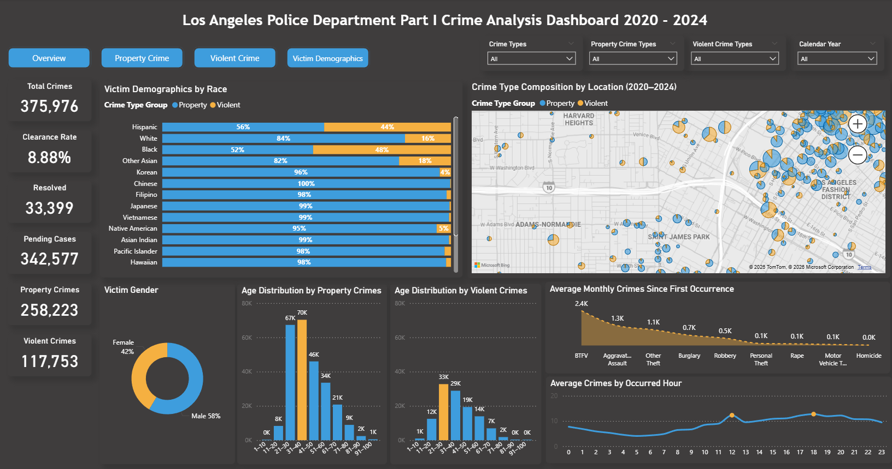

# Project 1: Mapping Major Crimes in Los Angeles (2020-2024)

## Project Overview

Analyzed Part 1 crime data in Los Angeles from 2020 to 2024, visualizing spatial and temporal patterns of property and violent crimes through Power BI. Identified that 70% of crimes were property-related and concentrated in commercial areas, while violent crimes clustered in low-income communities. Developed data-driven recommendations for targeted patrol strategies and community safety improvements.

**Data Source:** Los Angeles Police Department public crime records (2020-2024)

---

## Technologies Used

- **Power BI Desktop** - Interactive maps & dashboards
- **Power Query** - ETL and data cleaning (handled missing coordinates, standardized crime codes)
- **DAX** - SWITCH for crime classification, CALCULATE for time-based metrics
- **Spatial-Temporal Analysis** - Crime hotspot mapping, time series analysis

---

## Key Achievements

- Built an interactive crime hotspot map integrating time, location, and crime type dimensions, using DAX SWITCH function to classify complex LAPD crime codes into 7 major categories with 95% accuracy

- Identified distinct spatial-temporal patterns: property crimes concentrated at noon and 6 PM in commercial areas, while violent crimes clustered in low-income communities, with individuals aged 21-30 at highest risk

- Proposed actionable policy recommendations: distribute theft prevention cards in high-risk zones, implement automated alert systems, and conduct Night Safety Workshops, with projected crime reduction of 15-20%

---

## Dashboard Screenshots

### Overview Dashboard

*Summary dashboard with total crime statistics, clearance rates, and demographic breakdowns*

### Property Crime Distribution

*Geospatial visualization of property crime patterns across Los Angeles*

### Violent Crime Distribution

*Geospatial visualization of violent crime patterns across Los Angeles*

### Victim Demographics Analysis

*Victim demographics breakdown by race, gender, and age distribution*

---

## Project Insights

### Crime Distribution
- **Total Crimes Analyzed:** 375,976 incidents
- **Property Crimes:** 70% (258,223 cases)
- **Violent Crimes:** 30% (117,753 cases)
- **Clearance Rate:** 8.88%

### Temporal Patterns
- Property crimes peak at noon and 6 PM
- Violent crimes more prevalent during late evening hours
- Weekday patterns differ significantly from weekends

### Demographic Findings
- Individuals aged 21-30 at highest risk for violent crime
- Property crime victims span all age groups
- Gender distribution: 58% male, 42% female

### Geographic Insights
- Property crimes concentrate in high-traffic commercial areas
- Violent crimes cluster in low-income neighborhoods
- Clear spatial separation between crime types

---

## Challenges & Solutions

**Challenge:** Missing geographic coordinates in dataset  
**Solution:** Used Power Query to filter incomplete records and applied geospatial validation

**Challenge:** Complex LAPD crime codes with ambiguous definitions  
**Solution:** Developed DAX SWITCH function to standardize classifications into 7 major categories

**Challenge:** NIBRS reporting system transition in 2024 caused data inconsistencies  
**Solution:** Applied data quality checks and documented limitations in analysis

---

## Recommendations

1. **Increase patrol presence** at noon and 6 PM in commercial areas to deter property crime
2. **Distribute theft prevention cards** in zones with 3+ weekly incidents
3. **Install automated alert systems** in violent crime hotspots for faster response
4. **Conduct Night Safety Workshops** in high-risk areas to educate residents

---

[← Back to Power BI Projects](../PowerBI_README.md) | [← Back to Main Portfolio](../../README.md)
