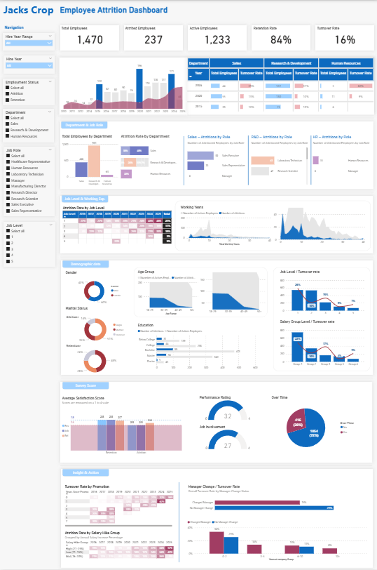
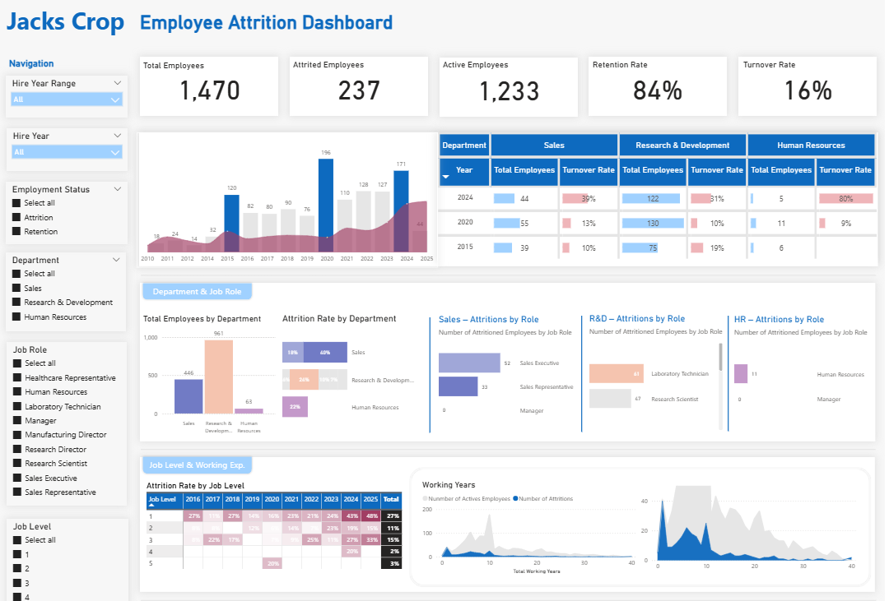

# Project 2: Employee Attrition Analysis

## Project Overview

Conducted comprehensive HR analytics examining 40-year workforce trends at Jack Crop, a hypothetical manufacturing company experiencing rapid expansion. Analyzed 1,470 employee records to identify attrition drivers and develop evidence-based retention strategies. Discovered a critical 133% increase in turnover rates from 2015 to 2024, with one in three employees leaving the company in recent years. Identified instability—not compensation—as the primary driver, revealing that 54% of departed Job Level 1 employees worked overtime with significantly lower satisfaction scores.

*Academic case study using simulated data for educational purposes.*

---

## Technologies Used

- **Power BI Desktop** - Multi-page interactive HR dashboards
- **Power Query (M language)** - Data cleaning, ETL processes, derived variable creation
- **DAX** - Calculated measures (hire year estimation from tenure, attrition rates, YoY comparisons, salary groupings)
- **Time-series Analysis** - 40-year historical trends with 5-year focused analysis (2020-2025)
- **Data Modeling** - Star schema with employee dimension, temporal analysis

---

## Key Achievements

- Identified 133% increase in attrition rate from 2015 (15%) to 2024 (35%), with Sales Representatives showing highest turnover at 57% in recent years, and Job Level 1 experiencing persistent 27% attrition rate across all time periods

- Discovered that 54% of departed Job Level 1 employees worked overtime with lower satisfaction scores across environment, job content, and relationships—revealing burnout as the primary driver beyond financial compensation

- Analyzed impact of organizational changes: employees who changed managers showed 19% higher turnover than those with stable management, while recent promotions (within 2 years) failed to prevent attrition, indicating deeper systemic issues

- Developed three-tier retention strategy addressing HR department stabilization (which experienced 80% turnover), structured onboarding programs for new hires, and clear role expectations with accessible support channels

---

## Dashboard Screenshots

### Complete Dashboard Overview

### Overview & Trend Analysis

### Demographics & Employee Survey Analysis

### Insights & Actionable Recommendations

---

## Project Insights

### Workforce Composition
- **Total Employees Analyzed:** 1,470 across 40 years
- **Current Attrited:** 237 employees (16% overall turnover)
- **Current Active:** 1,233 employees (84% retention)
- **Peak Hiring Years:** 2020 (196 hires), 2023 (175 hires), 2024 (121 hires)

### Attrition Trends
- **2015 Baseline:** 15% attrition rate
- **2020:** 11% attrition (improved period)
- **2024:** 35% attrition (233% increase from 2015)
- **Critical Finding:** Recent expansion correlated with tripled turnover rates

### Department Analysis
- **Sales Department:** 50% overall attrition rate, averaging 44% from 2020-2025
  - Sales Representatives: 57% peak turnover in recent years
  - Sales Executives: Lower but still elevated turnover
- **R&D Department:** 40% attrition rate
  - Laboratory Technicians and Research Scientists most affected
- **HR Department:** 80% turnover in 2024 (critical instability)

### Job Level Patterns
- **Level 1:** Consistently 27% attrition across all periods
- **Level 2:** 13% attrition
- **Level 3:** Upward trend from 25% to 33% over past 5 years
- **Levels 4-5:** Minimal attrition (executive retention strong)

### Demographic Insights
- **Gender Distribution:** 60% male, 40% female (balanced representation)
- **Age Groups:** Majority between 30-40 years old
- **Marital Status:** 
  - Attrited employees: 51% married, 35% single, 14% divorced
  - Retention employees: 48% married, 24% single, 28% divorced
- **Education:** Bachelor's degree holders most represented (473 employees)

### Overtime & Satisfaction Correlation
- **Critical Finding:** 54% of departed Job Level 1 employees worked overtime
- **Satisfaction Scores (1-4 scale):**
  - Environment: 2.8 (active) vs 2.7 (attrited)
  - Job Content: 2.8 (active) vs 2.5 (attrited) - significant gap
  - Relationships: 2.8 (active) vs 2.6 (attrited)
- **Performance Rating:** Maintained at 3.2 for both groups (attrition not performance-based)
- **Over Time Distribution:** 28% of attrited vs 72% retained employees worked overtime

### Manager & Promotion Impact
- **Manager Changes:** 19% higher turnover rate vs stable management
- **Recent Promotions:** Employees promoted within 2 years still departed
  - 62% of Level 1 attrition occurred despite recent promotions
- **Salary Adjustments:** Recent salary increases (within 2 years) failed to prevent turnover
  - High (>25%) salary increase group: 42% still left
  - Mid (16-20%) salary increase group: 27% attrition

---

## Methodology

### Data Preparation
1. **Cleaned 1,470 employee records** for consistency, formatting, and missing values
2. **Created derived variables:**
   - Hire year estimation: Current year (2025) - Years at Company
   - Salary groups: Categorized compensation ranges
   - Employment status: Active vs Attrited classification
3. **Treated dataset as 2025 snapshot:** All tenure calculations relative to 2025 regardless of current status
4. **Documented all variables** in comprehensive data dictionary

### Analysis Approach
- **Retrospective timeline analysis** from 1985-2025
- **5-year focused period** (2020-2025) for recent trends
- **Multi-dimensional segmentation:** Department, job role, job level, demographics
- **Comparative analysis:** Attrited vs active employee characteristics
- **Root cause identification:** Tested compensation, promotion, management, and satisfaction factors

---

## Challenges & Solutions

**Challenge:** Estimating hire years from tenure data without actual hire dates  
**Solution:** Calculated hire year as (2025 - Years at Company), treating all data as a 2025 snapshot for consistent temporal analysis

**Challenge:** Distinguishing correlation from causation in attrition drivers  
**Solution:** Cross-referenced multiple factors (overtime + satisfaction + promotions + manager changes) to identify patterns unique to attrited employees

**Challenge:** Identifying primary attrition driver among multiple confounding factors  
**Solution:** Discovered that financial incentives (raises, promotions) were present but insufficient—isolating burnout and instability as root causes

---

## Key Recommendations

### 1. Stabilize HR Department Before Expansion
**Current State:** 80% HR turnover rate in 2024 creates cascading instability  
**Recommendation:** Pause rapid hiring; strengthen HR team first  
**Rationale:** High HR turnover limits effective onboarding and retention management

### 2. Implement Structured Onboarding & Mentorship
**Target:** New employees within first 2 years (highest risk period)  
**Components:**
- Clear role expectations and training SOPs
- Assigned mentors for Job Level 1-2 employees
- Regular check-ins during first 6-12 months  
**Expected Impact:** Address clarity, connection, and confidence gaps

### 3. Address Workload & Support Systems
**Problem:** 54% of departed Job Level 1 worked overtime with low satisfaction  
**Solutions:**
- Workload audits for overtime-heavy roles
- Accessible support channels for problem resolution
- Manager training on team support and communication  
**Goal:** Reduce burnout-driven attrition

### 4. Enhance Management Continuity
**Finding:** Manager changes correlate with 19% higher turnover  
**Recommendations:**
- Minimize unnecessary organizational restructuring
- Transition support when manager changes unavoidable
- Leadership development for consistent management quality

---

## Business Impact

**Current Cost of Attrition:**
- 237 employees departed (16% overall, 35% in recent year)
- Estimated replacement cost: 50-200% of annual salary per employee
- Knowledge loss and productivity gaps during transitions

**Projected Impact of Recommendations:**
- **15-20% reduction in attrition** through burnout prevention
- **Improved HR capacity** for sustainable growth
- **Enhanced employee satisfaction** leading to stronger performance
- **Cost savings** from reduced recruitment and training expenses

---

[← Back to Power BI Projects](../PowerBI_README.md) | [← Back to Main Portfolio](../../Portfolio_README.md)

