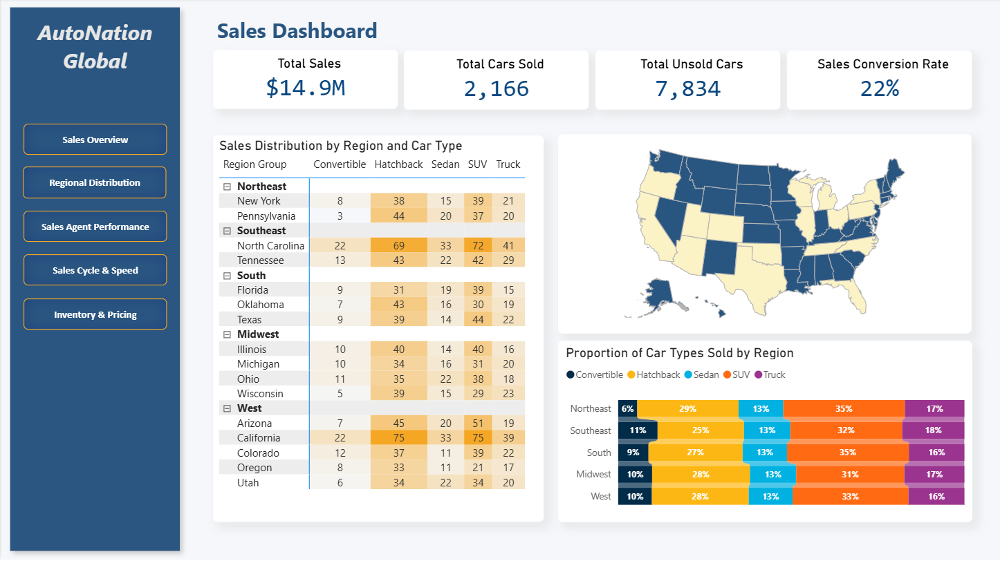
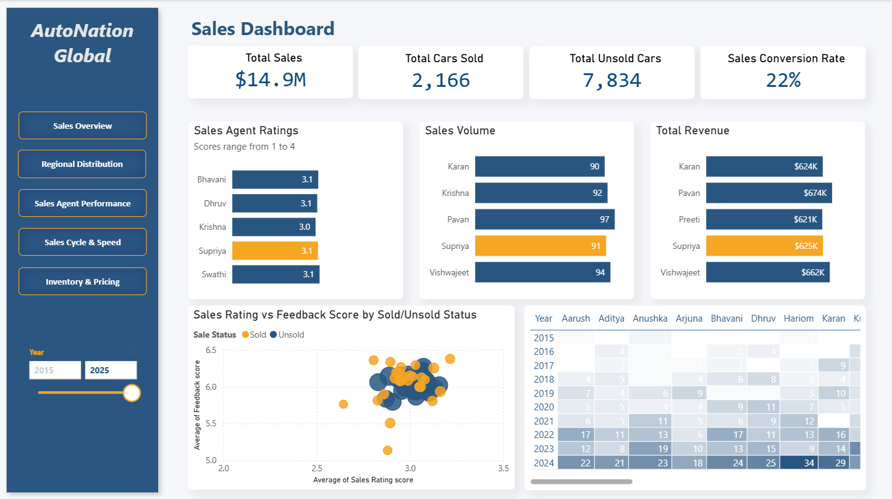

# Project 3: Used Car Sales Performance Analysis

## Project Overview

Analyzed 10 years of used car sales data across 18 states to optimize pricing strategies and inventory management for a hypothetical automotive dealership. Examined performance trends across 27 sales agents, regional car-type preferences, and sales cycle efficiency. Discovered remarkable 3,700% sales growth (47% CAGR) from 2015 to 2024, but identified critical pricing inefficiency: vehicles priced within a narrow $47 range across all mileage segments (0-100K miles), leading to inventory accumulation and reduced bargaining power.

*Academic case study using simulated data for educational purposes.*

---

## Technologies Used

- **Power BI Desktop** - 5-page interactive sales dashboard
- **Power Query (M language)** - Data cleaning, ETL, derived variable creation
- **DAX** - CAGR calculations, conversion rates, regional groupings, mileage bins
- **Geospatial Analysis** - Regional car-type preference mapping across US states
- **Sales Performance Analytics** - Agent ratings, sales cycle duration, revenue tracking

---

## Key Achievements

- Identified 3,700% sales growth trajectory with 47% CAGR from 2015 to 2024, with sales agents tripling their average performance from 7.5 vehicles (2021) to 24 vehicles per agent (2024), demonstrating scalable team productivity

- Discovered regional car-type preferences driven by urbanization and climate: coastal areas favor convertibles, urban centers (Philadelphia, Columbus, Tucson) prefer hatchbacks/sedans, while Midwest/Northeast/South regions favor SUVs and trucks for weather durability

- Uncovered critical pricing flaw: vehicles priced within narrow $47 range ($7,949-$7,996) across all mileage segments (0-20K to 80-100K miles), causing inventory accumulation of high-mileage vehicles and limiting sales negotiation flexibility

- Developed regional conversion rate optimization strategy: aligned sales focus with high-performing car types per region (e.g., hatchbacks 23-28% conversion in all regions, trucks 22-25% in West/Midwest) to improve inventory turnover and profit margins

---

## Dashboard Screenshots

### Sales Overview

### Regional Distribution

### Sales Agent Performance

### Sales Cycle & Speed

### Inventory & Pricing Analysis

---

## Project Insights

### Sales Growth & Performance
- **Total Sales Revenue:** $14.9M
- **Total Cars Sold:** 2,166 vehicles
- **Total Unsold Inventory:** 7,834 vehicles
- **Sales Conversion Rate:** 22%
- **Growth Rate:** 3,700% increase from 2015 to 2024
- **CAGR:** 47% compound annual growth rate

### Sales Agent Performance Evolution
- **2021 Average:** 7.5 vehicles per agent
- **2024 Average:** 24 vehicles per agent
- **Growth Factor:** 3x improvement over 3 years
- **Correlation:** Agent ratings (1-4 scale) directly reflected experience and sales volume
- **Top Performers:** Agents with consistent 3.0+ ratings handled higher volumes

### Regional Car-Type Preferences

**Northeast (New York, Pennsylvania):**
- Hatchback: 29% preference
- Sedan: 22%
- SUV: 35%
- Truck: 17%
- Pattern: Urban density drives compact vehicle preference

**Southeast (North Carolina, Tennessee):**
- Hatchback: 25%
- Sedan: 23%
- SUV: 32%
- Truck: 18%
- Convertible: 11% (coastal influence)

**South (Florida, Oklahoma, Texas):**
- Hatchback: 27%
- Sedan: 19%
- SUV: 35%
- Truck: 16%
- Pattern: Weather durability preference

**Midwest (Illinois, Michigan, Ohio, Wisconsin):**
- Hatchback: 28%
- Sedan: 19%
- SUV: 31%
- Truck: 17%
- Pattern: Winter weather drives SUV preference

**West (Arizona, California, Colorado, Oregon, Utah):**
- Hatchback: 28%
- Sedan: 22%
- SUV: 33%
- Truck: 16%
- Pattern: Outdoor lifestyle influences truck popularity

### Car Brand & Type Performance

**Highest Conversion Rates:**
- Prazo: 24%
- Hyundai: 24%
- Tata: 23%
- Renault: 23%

**Car Type Conversion:**
- Convertible: 24%
- Truck: 23%
- Hatchback: 22%
- SUV: 21%
- Sedan: 21%

**Average Days to Sell:**
- Renault: 743 days (longest)
- Hyundai: 682 days
- Prazo: 610 days
- Maruti: 629 days
- Kia: 534 days (shortest among major brands)

### Critical Pricing Issue

**Mileage vs. Price Analysis:**
- 0-20K miles: $7,985 average
- 20-40K miles: $7,949 average
- 40-60K miles: $7,974 average
- 60-80K miles: $7,983 average
- 80-100K miles: $7,996 average

**Price Range:** Only $47 variation across all mileage segments

**Implications:**
- Higher-mileage vehicles priced too high relative to market value
- Lower-mileage vehicles underpriced, missing profit opportunities
- Limited sales negotiation flexibility
- Inventory accumulation of high-mileage cars

### Regional Inventory Distribution
- **Northeast:** 859 unsold, 1,321 sold (61% sold rate)
- **Southeast:** 386 unsold, 1,268 sold (77% sold rate - best)
- **South:** 356 unsold, 1,791 sold (83% sold rate)
- **Midwest:** 466 unsold, 2,595 sold (85% sold rate)
- **West:** 713 unsold, 2,308 sold (76% sold rate)

---

## Methodology

### Data Coverage
- **Time Period:** 10 years (2015-2024)
- **Geographic Scope:** 18 states across 5 regions
- **Sales Team:** 27 agents tracked
- **Total Records:** 10,000 vehicle transactions

### Data Preparation
1. **Cleaned national sales records** for consistency, formatting, and accuracy
2. **Created derived variables:**
   - Regional groupings (Northeast, Southeast, South, Midwest, West)
   - Mileage bins (20K increments)
   - Sold vs Unsold status
   - Days to sell calculations
3. **Documented all variables** in comprehensive data dictionary

### Analysis Approach
- **5-page dashboard structure** for different analytical lenses
- **Sales Overview:** Overall performance metrics and growth trends
- **Regional Distribution:** Car-type preferences by geography and urbanization
- **Sales Agent Performance:** Individual ratings, volume, and revenue tracking
- **Sales Cycle & Speed:** Time-to-sell analysis by brand and type
- **Inventory & Pricing:** Margin analysis, mileage-price relationships, regional demand

---

## Challenges & Solutions

**Challenge:** Understanding regional car-type preferences without demographic data  
**Solution:** Analyzed urbanization levels, climate patterns, and coastal proximity to infer lifestyle and practical vehicle needs

**Challenge:** Identifying root cause of inventory accumulation  
**Solution:** Cross-referenced mileage, pricing, days-to-sell, and regional conversion rates to isolate pricing strategy as primary issue

**Challenge:** Measuring sales agent performance fairly across different market conditions  
**Solution:** Tracked both absolute sales volume and customer ratings to capture experience growth and quality metrics

---

## Key Recommendations

### 1. Implement Dynamic Pricing Strategy by Mileage
**Current Problem:** Flat $7,980 pricing across all mileage segments  
**Recommendation:**
- Premium pricing for 0-20K miles vehicles (+15-20%)
- Standard pricing for 20-60K miles
- Discount pricing for 60K+ miles (-10-15%)  
**Expected Impact:** Improved inventory turnover, better profit margins on low-mileage vehicles

### 2. Align Sales Focus with Regional Car-Type Conversion Rates
**Current Problem:** Sales agents sold hatchbacks and trucks without regional targeting  
**Recommendation:**
- **Northeast/Southeast:** Focus on hatchback sales (highest conversion 27-29%)
- **South/Midwest:** Emphasize SUV sales (31-35% conversion)
- **West:** Balance between hatchback (28%) and SUV (33%)  
**Expected Impact:** Faster inventory turnover, reduced holding costs

### 3. Optimize Sales Negotiation Flexibility
**Current Problem:** Narrow pricing range limits agent negotiation power  
**Recommendation:**
- Establish pricing bands with 15-20% flexibility
- Empower agents to adjust based on mileage, condition, demand
- Create incentive structure for clearing high-mileage inventory  
**Expected Impact:** Faster sales cycles, reduced Days to Sell

### 4. Leverage Top-Performing Agents for Training
**Finding:** Agents with 3.0+ ratings tripled productivity from 2021-2024  
**Recommendation:**
- Implement mentorship program pairing high-rated agents with newer team members
- Document and standardize best practices from top performers
- Create career progression path tied to rating improvements  
**Expected Impact:** Accelerated team ramp-up, consistent service quality

---

## Business Impact

**Current State:**
- $14.9M revenue with 22% conversion rate
- 7,834 unsold vehicles (78% of inventory)
- Pricing inefficiency limiting profit optimization

**Projected Impact of Recommendations:**
- **10-15% revenue increase** through dynamic pricing
- **25-30% reduction in inventory holding time** via regional alignment
- **5-7 percentage point improvement** in conversion rate (22% → 27-29%)
- **Enhanced profit margins** on low-mileage vehicles
- **Reduced carrying costs** from faster inventory turnover

---

[← Back to Power BI Projects](../PowerBI_README.md) | [← Back to Main Portfolio](../../README.md)

